1. 古堡中的勇者
   
   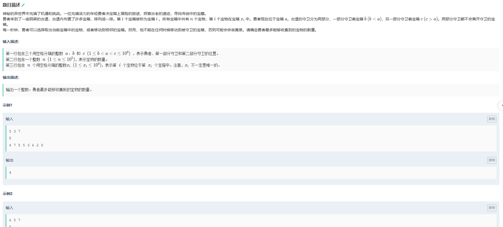
   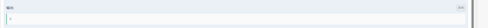

2. 三星五费
   
    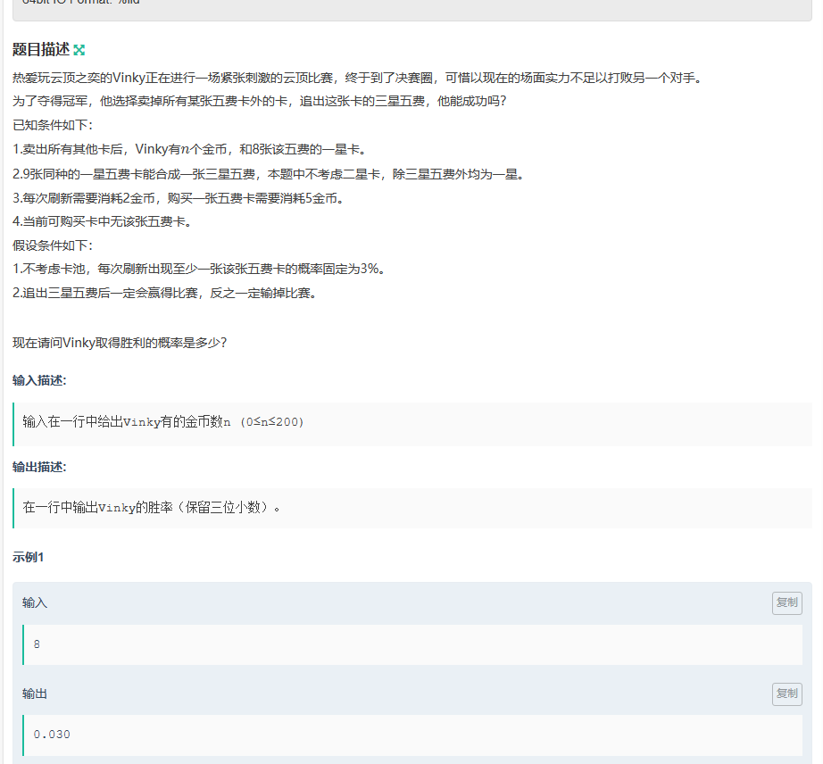

3. 我就要不协调
   
   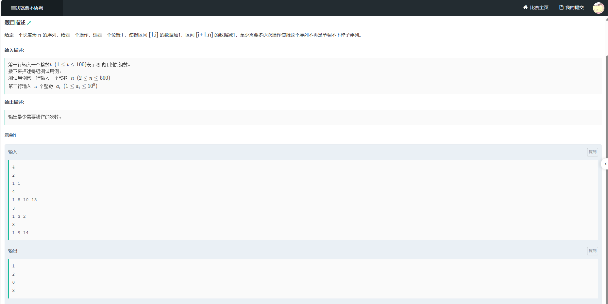

4. 古希腊长官原神的神
   
   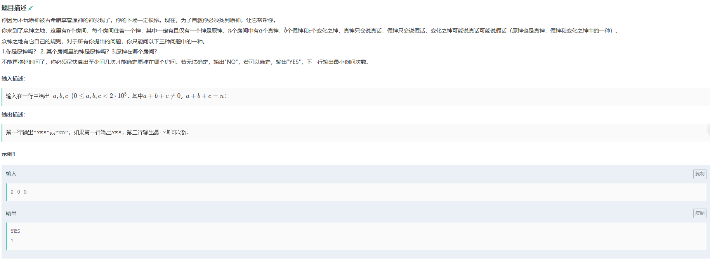
   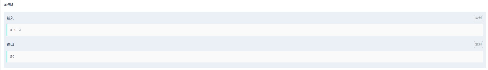

5. 字母匹配
   
   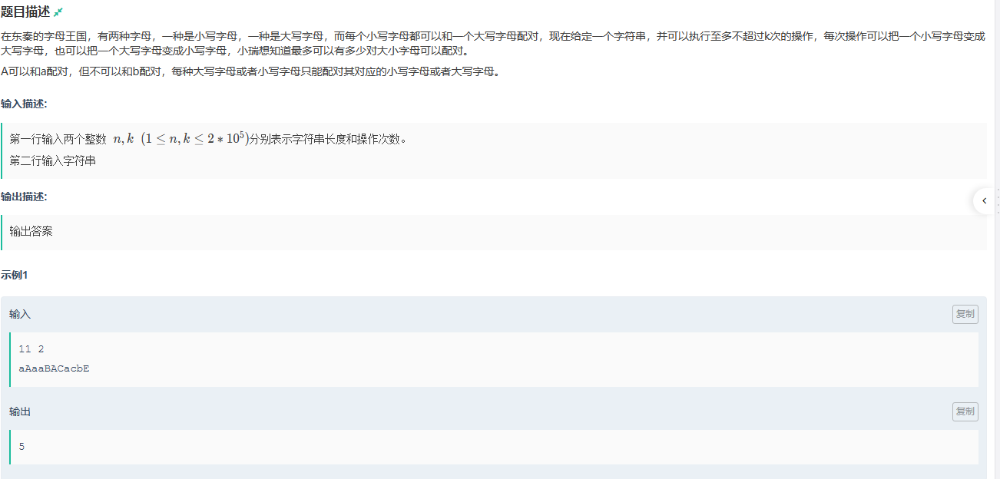

6. 数学家的四不要
   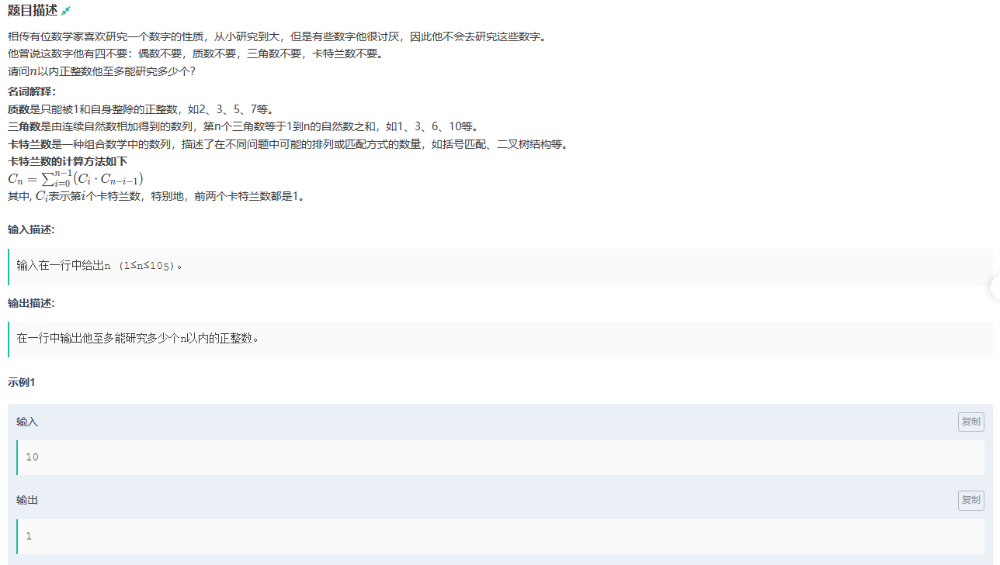

7. 旗鼓相当的对手
   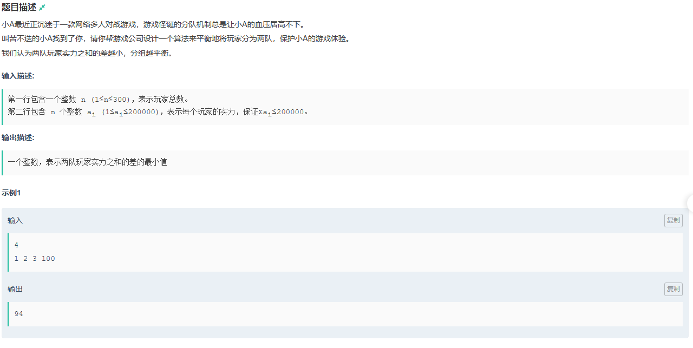
   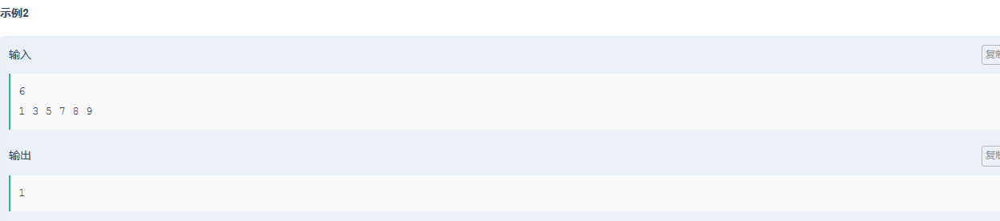

8. 卷王
   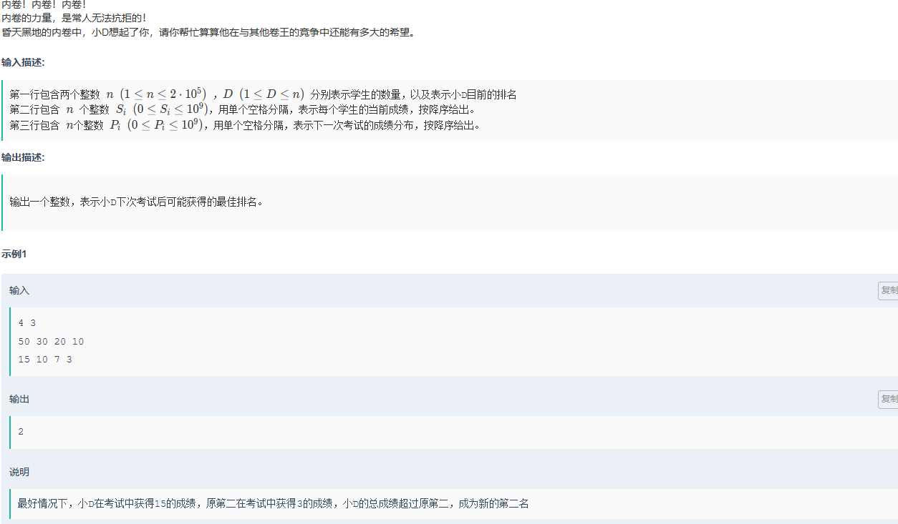

9.  字串比较
    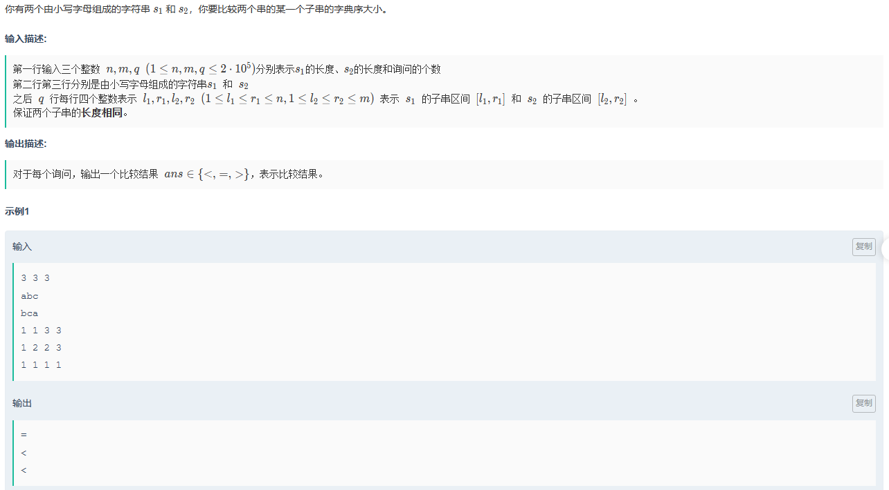

10. 学习计划
    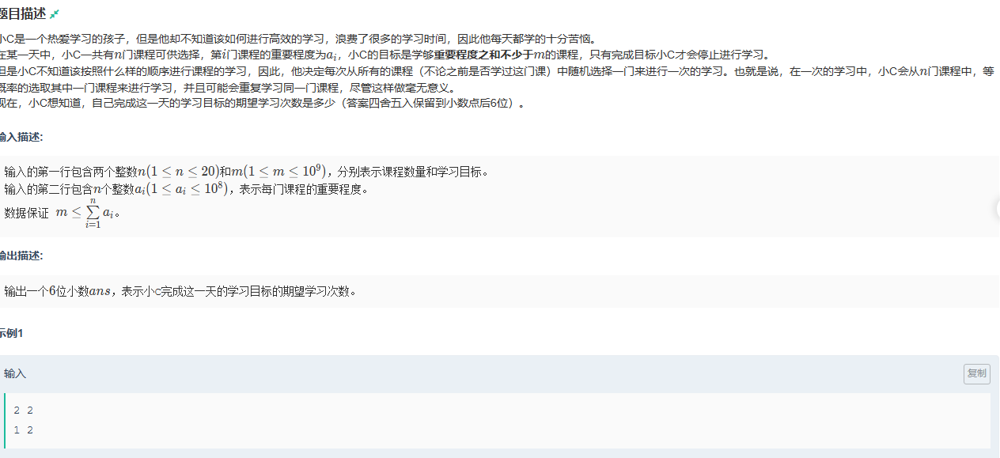
    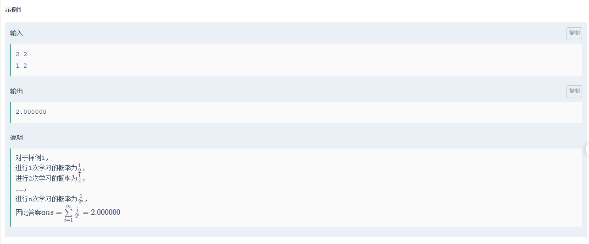
    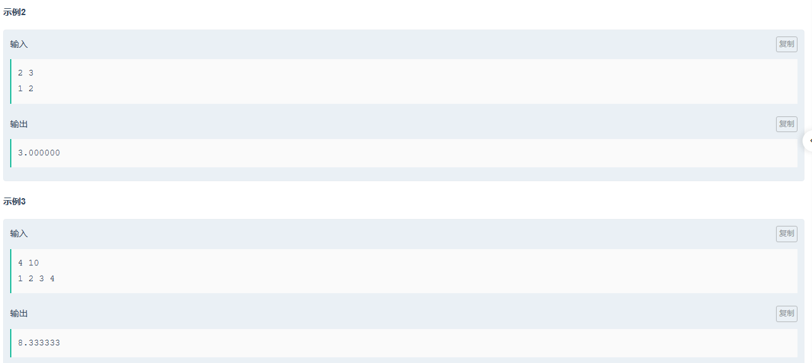

11. 同学聚会
    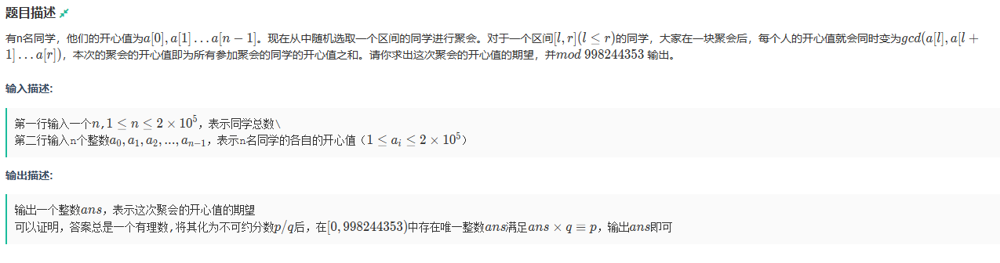
    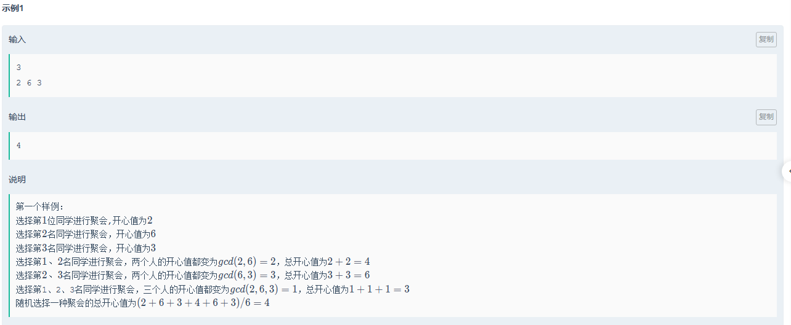
    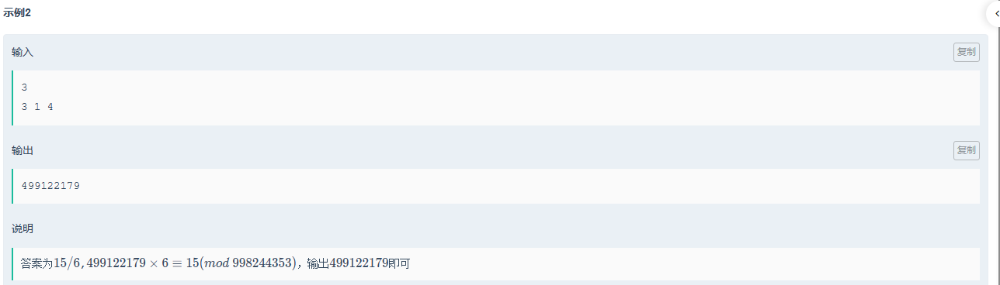

12. 善变游戏
    
    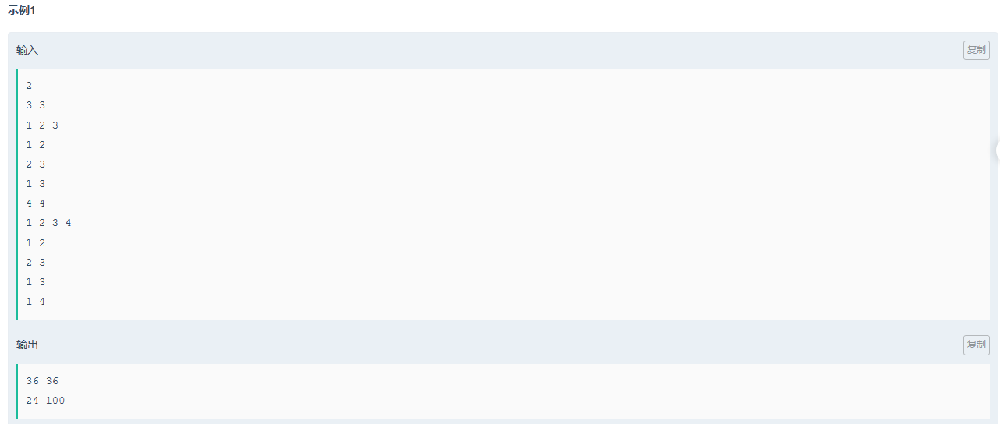
    
13. 网格谜题
    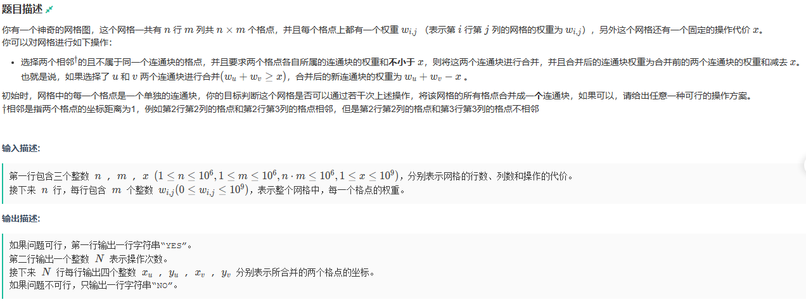
    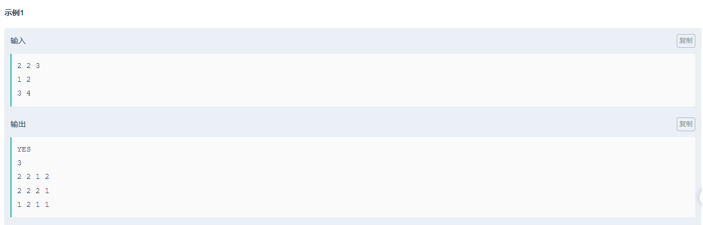
    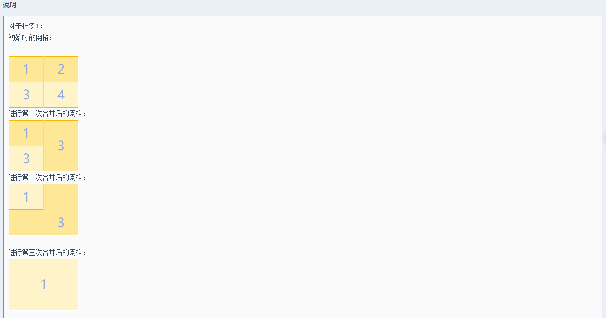
    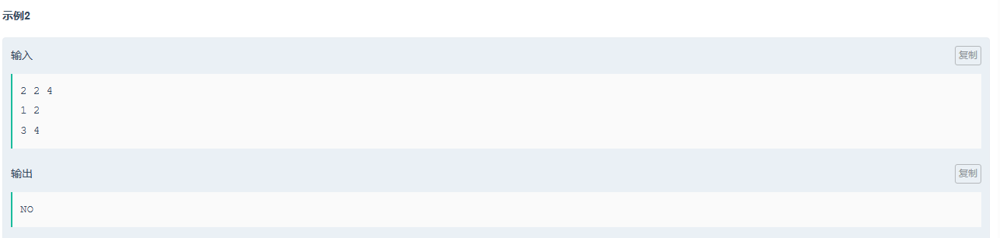